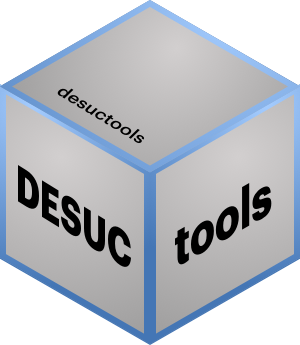

<!-- README.md is generated from README.Rmd. Please edit that file -->

```{r, include = FALSE}
knitr::opts_chunk$set(
  collapse = TRUE,
  comment = "#>",
  fig.path = "man/figures/",
  out.width = "100%"
)
```

# desuctools 

<!-- badges: start -->
[](https://github.com/DESUC/desuctools/actions)
<!-- badges: end -->

Funciones y datos auxiliares para análisis de encuestas sociales utilizados 
por la [Dirección de Estudios Sociales UC](http://sociologia.uc.cl/desuc) (DESUC).


## Instalación

Para instalar la versión en desarrollo de desuctools desde 
[GitHub](https://github.com/desuc/desuctools) puedes utilizar el siguiente código:  

``` r
# install.packages("devtools")
devtools::install_github("desuc/desuctools")
```

## Ejemplos

Base de datos con información sobre regiones y comunas.

```{r example}
library(dplyr, warn.conflicts = FALSE)
library(desuctools)

# Tabla con comunas capitales regionales.
desuctools::regiones_y_comunas %>% 
  filter(region_capital) %>% 
  arrange(region_orden) %>% 
  select(region, comuna, comuna_nom) %>% 
  desuctools::kable_desuc(align = 'rrl')
```
