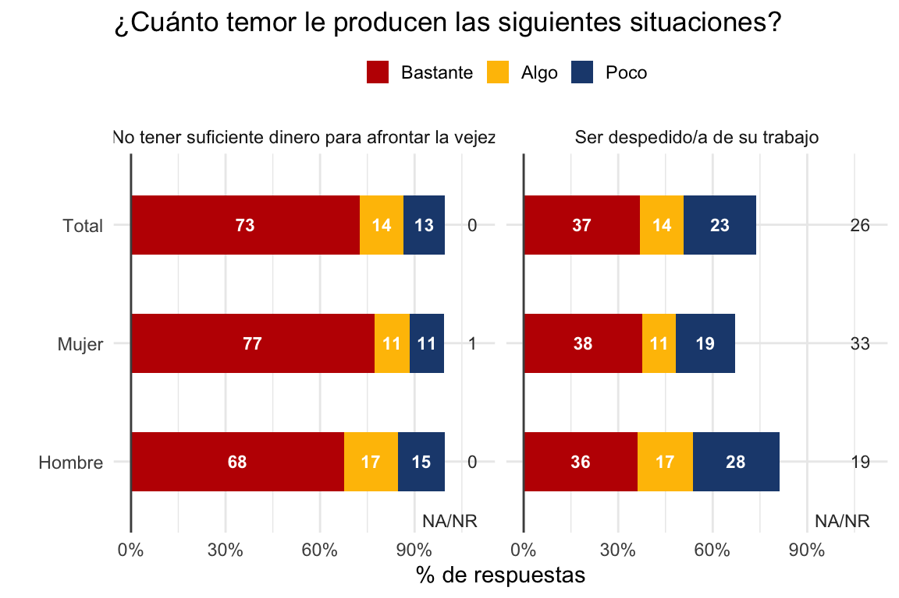

<!-- README.md is generated from README.Rmd. Please edit that file -->

# desuctools 

<!-- badges: start -->

[](https://github.com/DESUC/desuctools/actions)
<!-- badges: end -->

Funciones y datos auxiliares para análisis de encuestas sociales
utilizados por la [Dirección de Estudios Sociales
UC](http://sociologia.uc.cl/desuc) (DESUC).

## Instalación

Para instalar la versión en desarrollo de desuctools desde
[GitHub](https://github.com/desuc/desuctools) puedes utilizar el
siguiente código:

``` r
# install.packages("devtools")
devtools::install_github("desuc/desuctools")
```

## Ejemplos

### Datos de región y comuna

Base de datos con información sobre regiones y comunas.

``` r
# Tabla con comunas capitales regionales.
desuctools::regiones_y_comunas %>% 
  filter(region_capital) %>% 
  arrange(region_orden) %>% 
  select(region, comuna, comuna_nom) %>% 
  desuctools::kable_desuc(align = 'rrl', font_size = 9)
#> Warning in kableExtra::kable_styling(., latex_options = latex_options,
#> repeat_header_text = "(continuación)", : Please specify format in kable.
#> kableExtra can customize either HTML or LaTeX outputs. See https://
#> haozhu233.github.io/kableExtra/ for details.
```

| region | comuna | comuna\_nom  |
| -----: | -----: | :----------- |
|     15 | 15.101 | Arica        |
|      1 |  1.101 | Iquique      |
|      2 |  2.101 | Antofagasta  |
|      3 |  3.101 | Copiapó      |
|      4 |  4.101 | La Serena    |
|      5 |  5.101 | Valparaíso   |
|      6 |  6.101 | Rancagua     |
|      7 |  7.101 | Talca        |
|     16 |  8.401 | Chillán      |
|      8 |  8.101 | Concepción   |
|      9 |  9.101 | Temuco       |
|     14 | 14.101 | Valdivia     |
|     10 | 10.101 | Puerto Montt |
|     11 | 11.101 | Coyhaique    |
|     12 | 12.101 | Punta Arenas |

### Recodificación de variables

``` r
# Cargar base de encuesta Bicentenario
file <- tempfile()
download.file(url = 'https://github.com/DESUC/30diasdegraficos/raw/master/inputs/12-lollipop-df_bicen_19_30diasdegraficos_2020.rds',
              destfile = file)

data <- readRDS(file)

head(data)
#> # A tibble: 6 x 15
#>    folio     d07   t01_1   t01_2   t01_3   t02_1   t02_2   t03_1   t03_2   t03_3
#>    <dbl> <dbl+l> <dbl+l> <dbl+l> <dbl+l> <dbl+l> <dbl+l> <dbl+l> <dbl+l> <dbl+l>
#> 1 100101 2 [Muj… 2 [Bas… 6 [No … 1 [Muc… 2 [Bas… 3 [Alg… 1 [Muc… 1 [Muc… 1 [Muc…
#> 2 100102 2 [Muj… 1 [Muc… 1 [Muc… 1 [Muc… 3 [Alg… 5 [Nad… 1 [Muc… 1 [Muc… 1 [Muc…
#> 3 100103 1 [Hom… 1 [Muc… 2 [Bas… 1 [Muc… 1 [Muc… 1 [Muc… 1 [Muc… 5 [Nad… 2 [Bas…
#> 4 100104 2 [Muj… 1 [Muc… 1 [Muc… 1 [Muc… 4 [Poc… 4 [Poc… 4 [Poc… 4 [Poc… 3 [Alg…
#> 5 100105 2 [Muj… 1 [Muc… 2 [Bas… 1 [Muc… 5 [Nad… 3 [Alg… 4 [Poc… 1 [Muc… 2 [Bas…
#> 6 100106 2 [Muj… 1 [Muc… 1 [Muc… 1 [Muc… 1 [Muc… 5 [Nad… 1 [Muc… 4 [Poc… 4 [Poc…
#> # … with 5 more variables: t03_4 <dbl+lbl>, t04_1 <dbl+lbl>, t04_2 <dbl+lbl>,
#> #   t04_3 <dbl+lbl>, pond_se <dbl>
```

La función `desuctools::rec_cat_5a3` recodifica preguntas likert de 5 a
3 categorías, entregando la opción de agregar etiquetas a ellas.

``` r
data <- data %>%  
  mutate(across(c(t01_1:t01_2), 
                ~desuctools::rec_cat_5a3(., labels = c('Bastante' = 1, 
                                                       'Algo' = 2, 
                                                       'Poco' = 3, 
                                                       'NA/NR' = 9))))

data %>% head()
#> # A tibble: 6 x 15
#>    folio     d07   t01_1   t01_2   t01_3   t02_1   t02_2   t03_1   t03_2   t03_3
#>    <dbl> <dbl+l> <dbl+l> <dbl+l> <dbl+l> <dbl+l> <dbl+l> <dbl+l> <dbl+l> <dbl+l>
#> 1 100101 2 [Muj… 1 [Bas… 9 [NA/… 1 [Muc… 2 [Bas… 3 [Alg… 1 [Muc… 1 [Muc… 1 [Muc…
#> 2 100102 2 [Muj… 1 [Bas… 1 [Bas… 1 [Muc… 3 [Alg… 5 [Nad… 1 [Muc… 1 [Muc… 1 [Muc…
#> 3 100103 1 [Hom… 1 [Bas… 1 [Bas… 1 [Muc… 1 [Muc… 1 [Muc… 1 [Muc… 5 [Nad… 2 [Bas…
#> 4 100104 2 [Muj… 1 [Bas… 1 [Bas… 1 [Muc… 4 [Poc… 4 [Poc… 4 [Poc… 4 [Poc… 3 [Alg…
#> 5 100105 2 [Muj… 1 [Bas… 1 [Bas… 1 [Muc… 5 [Nad… 3 [Alg… 4 [Poc… 1 [Muc… 2 [Bas…
#> 6 100106 2 [Muj… 1 [Bas… 1 [Bas… 1 [Muc… 1 [Muc… 5 [Nad… 1 [Muc… 4 [Poc… 4 [Poc…
#> # … with 5 more variables: t03_4 <dbl+lbl>, t04_1 <dbl+lbl>, t04_2 <dbl+lbl>,
#> #   t04_3 <dbl+lbl>, pond_se <dbl>
```

### Tablas de resultados

Función `tabla_vars_segmentos`, la cual permite generar un `data.frame`
*tidy* con la cantidad y proporción de respuestas para un número
arbitrario de preguntas y un número arbitrario de segmentos de la
población.

``` r
data_tidy <- data %>% 
  desuctools::tabla_vars_segmentos(
                  total       = TRUE, # Incluye dato total 
                  .vars       = vars(t01_1, t01_2), # Listado de variables de interés
                  .segmentos  = vars(d07), # Listado de segmentos de interés
                  .wt         = pond_se) # Ponderador

data_tidy %>% 
  glimpse()
#> Rows: 24
#> Columns: 7
#> $ segmento_var <fct> d07, d07, d07, d07, d07, d07, d07, d07, d07, d07, d07, d…
#> $ segmento_cat <fct> Hombre, Hombre, Hombre, Hombre, Mujer, Mujer, Mujer, Muj…
#> $ pregunta_var <fct> t01_1, t01_1, t01_1, t01_1, t01_1, t01_1, t01_1, t01_1, …
#> $ pregunta_lab <fct> (No tener suficiente dinero para afrontar la vejez) ¿Cuá…
#> $ pregunta_cat <fct> Bastante, Algo, Poco, NA/NR, Bastante, Algo, Poco, NA/NR…
#> $ casos        <dbl> 666.867524, 169.146704, 148.294141, 3.352725, 818.345858…
#> $ prop         <dbl> 0.675198738, 0.171259863, 0.150146788, 0.003394611, 0.77…
```

### Manejo de etiquetas

Extraer el texto del ítem de una pregunta en matrices de preguntas
likert.

``` r
data_tidy %>% 
  mutate(pregunta_lab_short = desuctools::str_entre_parentesis(pregunta_lab),
         .keep = 'used', .before = 1) %>% 
  distinct() %>% 
  kableExtra::kable()
```

<table>

<thead>

<tr>

<th style="text-align:left;">

pregunta\_lab\_short

</th>

<th style="text-align:left;">

pregunta\_lab

</th>

</tr>

</thead>

<tbody>

<tr>

<td style="text-align:left;">

No tener suficiente dinero para afrontar la vejez

</td>

<td style="text-align:left;">

(No tener suficiente dinero para afrontar la vejez) ¿Cuánto temor le
producen las siguientes situaciones? @\_@ITERNAME@\_@

</td>

</tr>

<tr>

<td style="text-align:left;">

Ser despedido/a de su trabajo

</td>

<td style="text-align:left;">

(Ser despedido/a de su trabajo) ¿Cuánto temor le producen las siguientes
situaciones? @\_@ITERNAME@\_@

</td>

</tr>

</tbody>

</table>

``` r
data_tidy <- data_tidy %>% 
  mutate(pregunta_lab = desuctools::str_entre_parentesis(pregunta_lab))
```

### Gráficos

Función `desuctools::gg_bar_3_niveles_stack` para crear gráfico que
compare categorías positivas, negativas y neutras.

``` r
desuctools::gg_bar_3_niveles_stack(
  .df         = data_tidy,
  x           = segmento_cat, 
  facet_col   = pregunta_lab, 
  missing     = 'NA/NR', y_na = 1.1,  x_na = -2.5,
  title       = '¿Cuánto temor le producen las siguientes situaciones?',
  font_family = '')
```


